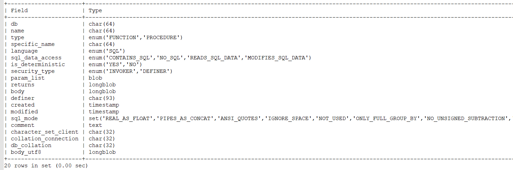

#  存储过程

```sql
mysql> use mysql;
Database changed
mysql> show tables;
+---------------------------+
| Tables_in_mysql           |
+---------------------------+
| columns_priv              |
| db                        |
| engine_cost               |
| event                     |
| func                      |
| general_log               |
| gtid_executed             |
| help_category             |
| help_keyword              |
| help_relation             |
| help_topic                |
| innodb_index_stats        |
| innodb_table_stats        |
| ndb_binlog_index          |
| plugin                    |
| proc                      |
| procs_priv                |
| proxies_priv              |
| server_cost               |
| servers                   |
| slave_master_info         |
| slave_relay_log_info      |
| slave_worker_info         |
| slow_log                  |
| tables_priv               |
| time_zone                 |
| time_zone_leap_second     |
| time_zone_name            |
| time_zone_transition      |
| time_zone_transition_type |
| user                      |
+---------------------------+
31 rows in set (0.00 sec)
```
> 存储过程在 mysql 的 proc 表中
```sql
desc mysql.proc;
```



## 创建存储过程

```sql
use test;

delimiter #
drop procedure if exists test;
create procedure test()
begin
	declare i int;
	set i = 1;
	while i < 11 do
	   select concat('cd', i);
	   set i = i + 1;
	end while;
end #
```

## 查看创建的存储过程
### 查看所有存储过程信息
```sql
mysql> select db,name,type from mysql.proc;
```
### 查看存储过程创建语句
```sql
mysql> show create procedure test.test\G;
*************************** 1. row ***************************
           Procedure: test
            sql_mode: ONLY_FULL_GROUP_BY,STRICT_TRANS_TABLES,NO_ZERO_IN_DATE,NO_ZERO_DATE,ERROR_FOR_DIVISION_BY_ZERO,NO_AUTO_CREATE_USER,NO_ENGINE_SUBSTITUTION
    Create Procedure: CREATE DEFINER=`root`@`localhost` PROCEDURE `test`()
begin
declare i int;
set i = 1;
while i < 11 do
   select concat('cd', i);
   set i = i + 1;
end while;
end
character_set_client: gbk
collation_connection: gbk_chinese_ci
  Database Collation: utf8_general_ci
1 row in set (0.00 sec)
```

## 调用存储过程
```sql
mysql> call test.test();
```

## 删除存储过程

```sql
mysql> drop procedure test.test;
```